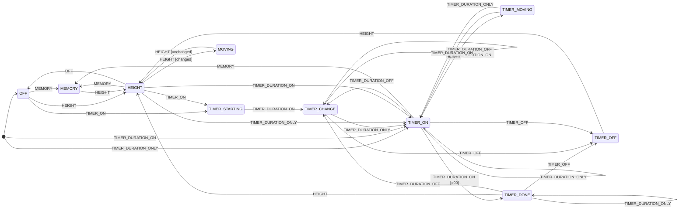

# ESPHome LoctekMotion Desk

ESPHome component for controlling Flexispot motorised desks (via a LoctekMotion controller). Inspired by https://github.com/iMicknl/LoctekMotion_IoT. 

Features:
- desk height sensor
- desk movement binary sensor
- binary sensor for the timer (alarm)
- timer remaining duration sensor
- control panel status text sensor (see State Machine below)
- controller connection binary sensor
- automation to set timer duration

Tested with Flexispot E7 (controller box model `CB38M2B(IB)-1`, control panel model `HS11A-1`).

## Hardware 

Refer to https://github.com/iMicknl/LoctekMotion_IoT.

## Installing

```yaml
external_components:
  - source:
      type: git
      url: https://github.com/muxa/esphome-loctekmotion-desk
```


## Configuration

```yaml
loctekmotion_desk:
    id: desk

    connected:
      name: "Connected"
      disabled_by_default: true

    height:
      name: "Height"
      filters:
        - heartbeat: 1s
        - delta: 0.1

    moving:
      name: "Moving"

    timer_active:
      name: "Timer Active"

    timer:
      name: "Timer"
      accuracy_decimals: 0
      icon: "mdi:timer"

    control_status:
      name: "Control Status"
      disabled_by_default: true

    up_button:
      name: "Up"
      id: button_up
      icon: mdi:arrow-up-box
      data: [0x9b, 0x06, 0x02, 0x01, 0x00, 0xfc, 0xa0, 0x9d]

    down_button:
      name: "Down"
      id: button_down
      icon: mdi:arrow-down-box
      data: [0x9b, 0x06, 0x02, 0x02, 0x00, 0x0c, 0xa0, 0x9d]

    preset1_button:
      id: preset1
      name: "Preset 1"
      icon: mdi:numeric-1-box
      data: [0x9b, 0x06, 0x02, 0x04, 0x00, 0xac, 0xa3, 0x9d]

    preset2_button:
      id: preset2
      name: "Preset 2"
      icon: mdi:numeric-2-box
      data: [0x9b, 0x06, 0x02, 0x08, 0x00, 0xac, 0xa6, 0x9d]

    preset3_button:
      id: preset3
      name: "Preset 3"
      icon:  mdi:numeric-3-box
      data: [0x9b, 0x06, 0x02, 0x10, 0x00, 0xac, 0xac, 0x9d]

    memory_button:
      name: "Memory"
      id: button_m
      internal: false
      icon: mdi:alpha-m-box
      data: [0x9b, 0x06, 0x02, 0x20, 0x00, 0xac, 0xb8, 0x9d]

    timer_button:
      name: "Timer"
      id: button_timer
      icon: mdi:alpha-a-box
      data: [0x9b, 0x06, 0x02, 0x40, 0x00, 0xAC, 0x90, 0x9d]

    on_timer_done:
      - logger.log: "Timer done"
```

Supports setting/changing the timer via automation, e.g:

```yaml
loctekmotion_desk.timer_set: 15
```

## State Machine

The state machine is used to reliably detect what the desk is doing as well as control it.



State machine inputs are based on the control panel display:

| Display Example | Display State               | Description                           |
|------------------|-----------------------------|---------------------------------------|
|                  | `UNKNOWN`                     | Initial state                         |
|  | `OFF`                         | Display is off                       |
|  | `MEMORY`                      | Memory button pressed|
|  | `HEIGHT`                     | Desk height                          |
|  | `TIMER_ON`                   | Timer is starting           |
|  | `TIMER_DURATION_ON`          | Timer (editing or running) |
|  | `TIMER_DURATION_OFF`         | When editing duration |
|  | `TIMER_DURATION_ONLY`        | Only timer duration digits are shown |
|  | `TIMER_OFF`                  | Timer turned off|
